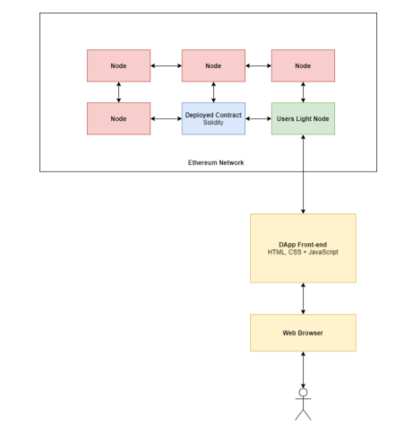

# On

**CryptoFund: A crowdfunding website Powered by Blockchain**

# In partial fulfillment of requirements for the degree of

**BACHELOR OF TECHNOLOGY IN**

**COMPUTER SCIENCE & ENGINEERING**

***with Specialization in Information and Cyber Security***

# Submitted by:

Siddharth Khandelwal \[19100BTCSICS05457\]

Kartik Bajpay \[19100BTCSICS05442\]

Sumit Prajapat \[19100BTCSICS05463\]

# Under the guidance of

PROF. MANOJ DHAWAN

{width="1.5820625546806648in"
height="1.5208333333333333in"}

**DEPARTMENT OF INFORMATION TECHNOLOGY**

**SHRI VAISHNAV INSTITUTE OF INFORMATION TECHNOLOGY SHRI VAISHNAV
VIDYAPEETH VISHWAVIDYALAYA, INDORE**

**JAN - JUNE 2022**

**Abstract**

Crowdfunding on the web is very popular these days. There are trust
issues with crowdfunding currently though. Most crowdfunding projects do
not deliver on time and some never deliver at all. Crowdfunding
platforms also act as middlemen you must trust to manage the transfer of
funds appropriately. These platforms charge fees for this service,
generally between 3% - 5% of all raised funding.

Blockchain technology offers good solutions to these problems. On a
Blockchain every transaction is traceable and transparent which helps
with trust. Smart contracts with predefined rules can dictate how money
is held and transferred removing the need to trust middlemen or pay
their fees. The decentralized and encrypted nature of Blockchain also
protects against malicious actors and single points of failure. This is
doubly important when managing sums of money.

This project is a fully decentralized crowdfunding platform built using
Blockchain technology and smart contracts. All transfers of funds are
handled by smart contracts deployed on a Blockchain while project
information is stored to the Inter Planetary File System, (IPFS. A
peer-to-peer decentralized file system), to save on gas without
sacrificing decentralization or security. Includes a React web app user
interface for users to create, donate to and display projects.

This decentralized application, (Dapp), can be run on the Ethereum
Mainnet, any of its test

Networks or a personal ganache Blockchain.

1.  **INTRODUCTION**

**Centralization and its Disruption: The Blockchain**

Although there is a large diversity of online platforms, most of them
entail centralized control over user data, server infrastructure, and
social network interactions. This raises multiple issues like: (1) data
is stored in centralized servers (e.g. Google, Facebook, Github) with
serious implications for user's privacy; (2) the value collectively
created by the community is appropriated and capitalized by the
infrastructure owner; (3) users are enclosed into walled gardens and
cannot interact beyond the platforms limits (propietary vs. free/libre
open source software); (4) users are subject to the laws of the country
in which the infrastructure operator is physically based (usually USA).
These issues have raised concerns from multiple actors, including the
European Commission \[4, 3, 9\], the World Wide Web Consortium W3C
\[14\] or the Free Software Foundation \[11, 7\]. As a response,
different platform architectures emerged like P2P networks. Although
this approach was already popular for file-sharing (e.g. eMule,
BitTorrent) it was the advent of Bitcoin \[8\] what further pushed it
forward. The underlying technology of Bitcoin, the decentralized
cryptographic ledger or blockchain, provided a paradigm shift for the
implementation of distributed systems.

**Crowdfunding:**

Crowdfunding is a form of alternative finance, in which a project is
funded by raising monetary contributions from a large number of people.
Typically, users or clients assume the cost of the project creation
before its implementation. If the project is successful, users are
commonly rewarded with perks (e.g. merchandising, premium services, or
an instance of the product developed) in exchange of their donations.
Crowdfunding popularity has grown exponentially since 2009, with the
advent of Kickstarter \[6\], facilitating the spread of ideas and
alternative financing \[5\]. New forms of crowdfunding have been
arising, going further the common Kickstarter model6: Goteo for open
projects which return to the commons, Gratipay for weekly payments for
software developers, or Patreon for creators receiving payments when
they produce a piece. There have been a few experimental attempts to
build decentralized crowdfunding on the blockchain7. The now defunct
Swarm attempted to provide investment-based crowdfunding. Koinify, also
defunct, aimed to focus on funding blockchain projects. Lighthouse, in
Beta stage, is a crowdfunding platform for the Bitcoin cryptocurrency
that allows the creation of crowdfunding campaigns for free \[10\].
Lighthouse can be used in a decentralized way, although its use is much
simpler using a centralized server (something that could be avoided if
it used Ethereum instead of the Bitcoin Blockchain)

**Smart Contract:**

A \"smart contract\" is simply a program that runs on the Ethereum
blockchain. It\'s a collection of code (its functions) and data (its
state) that resides at a specific address on the Ethereum blockchain.

Smart contracts are a type of Ethereum account. This means they have a
balance and they can send transactions over the network. However
they\'re not controlled by a user, instead they are deployed to the
network and run as programmed. User accounts can then interact with a
smart contract by submitting transactions that execute a function
defined on the smart contract. Smart contracts can define rules, like a
regular contract, and automatically enforce them via the code. Smart
contracts cannot be deleted by default, and interactions with them are
irreversible.

2.  **PROBLEM DOMAIN:**

The reason companies and products can't survive when they land on
crowdfunding platforms such as Kickstarter is because of its pre-pay
system. Usually when developer raises money, they hire some people so
they can develop a better product faster. They set up a company. Hire
more people, rent an office, make deals, and hire more people. People
give money to developers, and they expect product in return. But until
the company finishes product, they are going bankruptcy already. They
are spending the money that isn't their own. Kickstarter's system is
like a loan. When companies will send their products to users, the
profit margin that is left from whole money won't be enough to survive,
so they will take more loan from someone else or bank. And to pay that
loan they have to sell more product. So this cycle usually doesn't
happen. Usually companies reschedule landing constantly and then end the
project.

Crowdfunding is one of the most popular ways to raise funds for any
project, cause or for helping any individual in need. With the onset of
Covid we have seen a rise in Crowdfunding activities across the globe
which includes small campaigns to help people get oxygen and medical
help to large funds such as PM Cares.

The major problems with the Current Crowdfunding Platforms that we
wanted to solve were:

-   **Security:** As the funds become larger, they need to be heavily
    > secure, although stringent measures such as symmetric encryption
    > are in place to make e-payment safe and secure, it is still
    > vulnerable to hacking. Blockchain which has never been compromised
    > yet --- can provide that level of security.

-   **Transparency and Anti-Fraud:** We have seen, and continue to see a
    > lot of crowdfunding scams happening around. There is no way to see
    > where the funds are being used. We wanted to make the entire flow
    > of funds transparent at every stage, so that there is no
    > possibility of the money being misused.

-   **Global contribution: **With some of the platforms being country
    > specific, it becomes hard for people from other countries to
    > contribute to various campaigns. Using Blockchain anyone in the
    > world can contribute to the campaign. Transactions are quick and
    > convenient.

We were highly inspired by the CryptoRelief initiative
([[www.cryptorelief.in]{.underline}](https://www.google.com/url?q=https://www.google.com/url?q%3Dhttp://www.cryptorelief.in%26amp;sa%3DD%26amp;source%3Deditors%26amp;ust%3D1642765098250675%26amp;usg%3DAOvVaw0ii9Me8JATVsqOiWAgS8lK&sa=D&source=docs&ust=1642765098296656&usg=AOvVaw1j3oVfhtG9cGZYiwSzBclH) ) which
raised \~1 billion dollars for Covid Relief in India from the entire
global community, in a highly transparent manner.

{width="5.816666666666666in"
height="3.075in"}

**A simple google search on Kickstarter scams**

3.  **SOLUTION DOMAIN:**

Any web based application is a centralized application which means that
anything we do on the platform is managed by a server which is owned by
a single company.

We propose a Decentralized Application powered by Ethereum Blockchain,
where all the information about campaigns, contributions, withdrawal
requests and funds are kept on a Blockchain Network, visible to all and
decentralized. This means the funds and transactions are visible to and
stored at every node on the blockchain, and prevents the data from being
stored in a centralized server, single location.

Hence not letting the money get into the hands of anyone and eliminating
every possibility of it getting misused --- an elegant and logical
solution to the problem in hand.

The features are explained below:

-   **Creating a Campaign:** Just like Crowdfunding in the real world as
    > well as on other crowdfunding platforms, anyone can create a
    > campaign in a few minutes. The campaign information will be
    > managed by the Ethereum-based smart contract and thus cannot be
    > tampered with.

-   **Contributing to a Campaign:** Once a campaign has been created,
    > users can share the campaign and anybody can contribute to the
    > campaign. The funds will go to the address of the campaign and not
    > to the creator of the campaign, thus making the process more
    > efficient and anti-fraudulent.

-   **Withdrawal of Funds:** The Creator of a Campaign can propose how
    > to use the funds in the form of a Withdrawal Request. Anybody who
    > contributes more than a particular amount is called an approver,
    > and will be able to approve or deny the request.

> Funds can't be withdrawn without the approval of 50% approvers

**Identifying stakeholders**

The stakeholders can be divided into two parts:

-   **Campaign Creators:** These are the users who have created a
    > Campaign.

-   **Contributors & Approvers**: Contributors are the users who
    > contribute and fund the campaigns. Approvers are Contributors who
    > have contributed more than the Minimum

> Contribution, and they can approve the withdrawal requests.

**Feasibility: Technical and Non-Technical**

-   **Technical Feasibility**

> It is to be a ReactJS based application, which will be supported by
> any web browser.
>
> Internet connectivity will be required.
>
> Users will require 'Metamask' browser extension to sign transactions.

-   **Social Feasibility**

> Crowdfunding over the years has helped people but has also seen heavy
> frauds in the name of Crowdfunding. With CryptoFund we want to bring
> transparency to the process of crowdfunding and build trust among
> people to contribute to all the causes.

-   **Economic Feasibility**

> Given the Ethereum Blockchain provides us with most of the security
> features, the development does not require much cost.
>
> The only cost would be the server cost of the deployed application.

-   **Scope**

> With CryptoFund we aim to make the crowdfunding process transparent,
> anti-fraudulent and secure.

{width="6.525in"
height="5.591666666666667in"}

**Concept Architecture of proposed solution**

{width="6.425in"
height="3.6333333333333333in"}

{width="6.652777777777778in"
height="2.1666666666666665in"}

{width="6.652777777777778in"
height="2.783333333333333in"}

**System Architecture of proposed solution**

4.  **SYSTEM DOMAIN:**

**Technology to be used:**

-   **Blockchain:** A decentralized database consisting of blocks that
    are linked using cryptography. Secure by design. Typically used as a
    distributed ledger, managed by a peer-to-peer network adhering to a
    protocol for block validation and node communication.

-   **Smart contracts:** A self-executing computer program which
    implements the terms of an agreement between 2 parties.

-   **Decentralized Application:** An application that runs on a
    distributed computer system. In this case the Ethereum Virtual
    Machine.

-   **Web3.js:** A JavaScript API that allows you to interact with a
    local or remote Ethereum node using HTTP.

-   **Solidity:** A programming language for writing smart contracts.

-   **Truffle:** A development environment, testing framework and asset
    pipeline for blockchain development.

-   **Ganache:** A personal blockchain that can be run locally to test
    smart contract functionality and deployment.

-   **Account Balance:** In Ethereum all accounts have an Eth balance
    associated with them. This includes smart contracts which can also
    sore Eth.

-   **Light node**: Unlike a full node which stores the whole blockchain
    this type of node only stores the header chain and requests
    everything else. It allows users to interact with other nodes on the
    blockchain without the large SSD storage requirements of running a
    full node.

-   **Stretch goals:** In the context of crowdfunding this refers to a
    funding target that is set beyond the original target for the
    project. Each "stretch goal" will coincide with an expansion of the
    scope of the project to add improvements and/or features.

-   **Gas:** Refers to a fee paid to miners as an incentive for them to
    mine blocks. Mining blocks completes transactions and executes
    contracts.

-   **NextJS:** Next.js is an open-source React front-end development
    web framework that enables functionality such as server-side
    rendering and generating static websites for React based web
    applications.

-   **Chakra UI**: Chakra UI is a simple, modular and accessible
    component library that gives the building blocks one needs to build
    React applications.

5.  **APPLICATION DOMAIN**

**Scope of the project:**

The application will implement a Donation-based model of crowdfunding
similar to

Kickstarter. This means project creators can start a project by defining
the features of the project, the funding goal of the project and a time
period in which to reach the funding goal. They can also set rewards for
different donation sizes. Funds are only paid to the creator at the end
of the defined time period, if the funding goal has been reached. If the
funding goals of the project are exceeded the creator has the option to
add more features to the project and increase the funding goal. Non
creators will be able to browse the list of projects in progress and
donate to them if they wish. If time permits the scope of the project
could be expanded to include other models of crowdfunding.

The systems functionality will come from the execution of smart
contracts stored on the Ethereum Blockchain. Users will interact with
the smart contracts via a Geth node and a web-based frontend which can
interact with that node. This will allow them to create, browse and
donate to projects with the complexity of the Blockchain abstracted from
them. The frontend will be built using HTML, CSS and JavaScript and
interact with the Geth node using web3.js which is a JavaScript library.
Smart contracts will be written and compiled using Solidity. Safe
development and testing will be done using the Truffle framework and
Ganache local Blockchain. The Rinkeby test Blockchain will be used as
essentially a staging server.

6.  **EXPECTED OUTCOME**

**The Expected Functionality of the project**

1.  **Starting a new project:**

> The application front-end will allow project creators to start a new
> project by navigating to the "Create Project" page. Here they will be
> instructed to enter the attributes of the project which will include a
> project name, description, funding goal and end date (the date at
> which the funding goal must be reached). They will also be instructed
> to set rewards for donation sizes. The front-end will then send a
> transaction to the address of the smart contract (already deployed on
> the Blockchain) using gas from the creators account. The smart
> contract will then store all the relevant information on the
> Blockchain.

2.  **Browsing projects in progress:**

> The front-end will also allow users to browse the projects that are
> currently in progress by navigating to the "Explore Projects" page.
> This page will display the list of projects and their current status
> which includes all the information entered by the project creator, the
> rewards for donation sizes, the amount that has been raised so far and
> the time remaining for the project to reach its goal.

3.  **Donating to a project:**

> From the "Explore Projects" page a user can also chose to donate to a
> project. To do this they will first select the project, then enter the
> desired amount and click a button. The front-end will then send a
> transaction to the address of the smart contract using Eth from the
> donators account which will update the amount raised if there is time
> remaining for the project. The Eth will be stored in the smart
> contracts account balance.

4.  **Request creation & approval:**

> The Creator of a Campaign can propose how to use the funds in the form
> of a Withdrawal Request. Anybody who contributes more than a
> particular amount is called an approver, and will be able to approve
> or deny the request.
>
> Funds can't be withdrawn without the approval of 50% approvers

5.  **Pay funding to creator if goal is reached:**

> If the goal of the project has been reached by the projects end the
> creator will receive the funds. This will be a function coded into the
> smart contract that will check if the funding goal has been reached
> when the time remaining in the project expires. If so, it will send a
> transaction with the correct amount of Eth to the project creator's
> account.

6.  **Return funds to donators if goal is not reached:**

> If the goal of the project is not reached by the projects end the
> donators will receive their funding back. This will be a function
> coded into the smart contract that will check if the funding goal has
> been reached when the time remaining in the project expires. If the
> goal has not been reached the contract will return the Eth to the
> accounts of the donators.

7.  **Recording which donators are entitled to rewards:**

> The project creator will be able to see which rewards each donator is
> entitled to base on the amount they donated.

8.  **Allowing creators to add "stretch goals":**

> If the projects funding goal is meet the creator will have the option
> to expand the scope of the project to include new features or
> improvements in return for an increased funding goal.

7.  **References:**

-   Information about the Kickstarter website and how they implement a
    > rewards based crowdfunding model:
    > <https://www.kickstarter.com/about>

> \[Accessed on: 22/02/2022\]

-   Ethereum documentation: <https://docs.ethhub.io/>

> \[Accessed on: 21/02/2022\]

-   The Solidity programming language documentation:
    > <https://docs.soliditylang.org/en/v0.7.4/>

> \[Accessed on: 16/02/2022\]

-   Go Ethereum (geth) documentation: <https://geth.ethereum.org/docs/>

> \[Accessed on: 21/02/2022\]

-   Web3.js API documentation:
    > <https://web3js.readthedocs.io/en/v1.3.0/>

> \[Accessed on: 21/02/2022\]

-   Szabo, N.: The idea of smart contracts. Nick Szabos Papers and
    > Concise Tutorials

> \[Accessed on: 19/02/2022\]

-   A. Rosic, \"Blockgeeks,\" \[Online\]. Available:
    > <https://blockgeeks.com/blockchain-crowdfunding/>.

> \[Accessed 18/02/2022\].

-   Blogger, \"Finance Magnates,\" 22 May 2015. \[Online\].
    > Available:<https://www.financemagnates.com/cryptocurrency/bloggers/why-the-blockchain-will-soon-become-a-household-name/>

> \[Accessed 19/02/2022\].

-   J. S. Calvery, \"Statement of Jennifer Shasky Calvery, Director
    > Financial Crimes

> Enforcement Network United States Department of the Treasury before
> the United States Senate Committee on Homeland Security and Government
> Affairs," 18 November 2013. \[Online\]. Available:
> <https://www.fincen.gov/sites/default/files/2016-08/20131118.pdf>.
>
> \[Accessed 20/02/2022\].

-   \"Wikipedia,\" \[Online\]. Available:
    > <https://en.wikipedia.org/wiki/Solidity>.

> \[Accessed 17/02/2022\]

-   G. Hayes, \"The Beginners Guide to Using an Ethereum Test Network,\"
    > 16 February 2018. \[Online\]. Available:
    > <https://medium.com/compound-finance/the-beginners-guide-to-using-an-ethereum-test-network-95bbbc85fc1d>

> \[Accessed 01/03/2022\].
